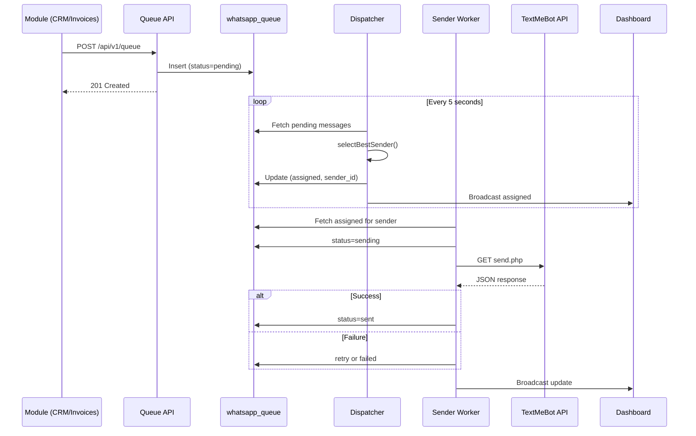

# WA Queue — Enterprise WhatsApp Queue Management System

> Laravel 12 · Vue 3 · PrimeVue · Pinia · TextMeBot API · Multi-Tenancy

---

## 1. System Overview

```
┌─────────────────────────────────────────────────────────────────────────────┐
│                         CENTRAL APPLICATION (Landlord)                      │
│  Tenants · Plans · Billing · Super Admin · Tenant Provisioning             │
└─────────────────────────────────────────────────────────────────────────────┘
                                      │
                    ┌─────────────────┼─────────────────┐
                    ▼                 ▼                 ▼
            ┌──────────────┐  ┌──────────────┐  ┌──────────────┐
            │  Tenant A    │  │  Tenant B    │  │  Tenant C    │
            │  (DB/Schema) │  │  (DB/Schema) │  │  (DB/Schema) │
            └──────────────┘  └──────────────┘  └──────────────┘
```

Each **Tenant** (مشترك) is fully isolated:
- Own database (stancl/tenancy)
- Own WhatsApp senders & API keys
- Own queue, settings, logs, analytics
- Own API tokens for module integration

---

## 2. Multi-Tenancy Strategy

| Aspect | Approach |
|--------|----------|
| Package | `stancl/tenancy` v3 |
| Isolation | Database-per-tenant |
| Identification | Subdomain (`tenant1.wa-queue.local`) or custom domain |
| Central DB | `tenants`, `domains`, `plans`, `users` (landlord) |
| Tenant DB | All WhatsApp tables, settings, logs |

### Tenant Lifecycle

```
Register → Create Tenant Record → Provision DB → Seed Defaults → Ready
```

---

## 3. Database Schema

### 3.1 Central (Landlord) Tables

#### `tenants`
| Column | Type | Description |
|--------|------|-------------|
| id | UUID | Primary key |
| name | string | Company name |
| slug | string | Unique identifier |
| email | string | Admin email |
| plan | string | free / pro / enterprise |
| status | enum | active / suspended / trial |
| data | json | Extra metadata |
| created_at | timestamp | |
| updated_at | timestamp | |

#### `domains`
| Column | Type | Description |
|--------|------|-------------|
| id | bigint | PK |
| domain | string | tenant1.wa-queue.test |
| tenant_id | UUID | FK → tenants |

---

### 3.2 Tenant Tables

#### `whatsapp_senders`
| Column | Type | Description |
|--------|------|-------------|
| id | bigint | PK |
| name | string | Display name (e.g. "WhatsApp Business 1") |
| phone | string | +964750XXXXXXX |
| api_key | text | Encrypted TextMeBot API key |
| status | enum | online / busy / offline |
| delay_seconds | int | Min delay between sends (default 6) |
| daily_limit | int | Max messages per day (default 500) |
| today_sent | int | Counter reset daily at midnight |
| priority | int | Higher = preferred in tie-breaks |
| last_sent_at | timestamp | Last successful send |
| last_seen | timestamp | Last API status check |
| last_error | text | Last API error message |
| avg_response_ms | int | Rolling average API response time |
| enabled | boolean | Active/Inactive toggle |
| is_sending | boolean | Currently processing a message |
| round_robin_index | int | For round-robin ordering |
| created_at | timestamp | |
| updated_at | timestamp | |

**Indexes:** `enabled`, `status`, `priority`

---

#### `whatsapp_queue`
| Column | Type | Description |
|--------|------|-------------|
| id | bigint | PK |
| phone | string | Recipient phone (+964...) |
| recipient_name | string | Optional display name |
| message | text | Message body |
| source | string | contracts / crm / sales / invoices / support / marketing / appointments |
| event | string | e.g. `invoice.created`, `appointment.reminder` |
| priority | int | 1=low, 5=normal, 10=high |
| status | enum | pending / assigned / sending / sent / failed / cancelled |
| sender_id | bigint | FK → whatsapp_senders (nullable until assigned) |
| scheduled_at | timestamp | Optional future send time |
| sent_at | timestamp | Actual send time |
| retry_count | int | Current retry attempt |
| max_retry | int | Max retries (from settings) |
| provider_response | json | TextMeBot API response |
| error_message | text | Last error |
| unique_key | string | Deduplication key (unique) |
| created_by | string | User or module identifier |
| duration_ms | int | Send duration |
| created_at | timestamp | |
| updated_at | timestamp | |

**Indexes:** `status`, `sender_id`, `source`, `priority`, `scheduled_at`, `unique_key` (unique)

---

#### `whatsapp_queue_logs`
| Column | Type | Description |
|--------|------|-------------|
| id | bigint | PK |
| queue_id | bigint | FK → whatsapp_queue |
| sender_id | bigint | FK → whatsapp_senders (nullable) |
| action | string | assigned / started_sending / api_response / retry / moved / completed / cancelled / failed |
| message | text | Human-readable log |
| metadata | json | Extra context |
| created_at | timestamp | |

---

#### `whatsapp_settings`
| Column | Type | Description |
|--------|------|-------------|
| id | bigint | PK |
| key | string | Setting key |
| value | text | JSON-encoded value |
| created_at | timestamp | |
| updated_at | timestamp | |

**Default Settings:**
```json
{
  "queue_enabled": true,
  "default_delay_seconds": 6,
  "max_retry": 3,
  "retry_delay_seconds": 60,
  "load_balancing_mode": "least_queue",
  "automatic_failover": true,
  "round_robin_enabled": false,
  "offline_redistribute": true,
  "status_check_interval_seconds": 60
}
```

**Load Balancing Modes:**
- `least_queue` — Select sender with smallest pending+assigned queue
- `round_robin` — Rotate through available senders
- `fixed` — Always use specified `fixed_sender_id`
- `priority` — Highest priority sender with capacity

---

#### `api_tokens`
| Column | Type | Description |
|--------|------|-------------|
| id | bigint | PK |
| name | string | Token label (e.g. "CRM Module") |
| token | string | Hashed API token |
| abilities | json | Allowed sources |
| last_used_at | timestamp | |
| created_at | timestamp | |

---

## 4. Status State Machine

```
                    ┌──────────┐
                    │ PENDING  │◄── Module inserts message
                    └────┬─────┘
                         │ Dispatcher assigns sender
                         ▼
                    ┌──────────┐
                    │ ASSIGNED │
                    └────┬─────┘
                         │ Worker picks up
                         ▼
                    ┌──────────┐
         ┌─────────│ SENDING  │─────────┐
         │         └────┬─────┘         │
         │              │ Success       │ Failure
         ▼              ▼               ▼
    ┌──────────┐   ┌──────────┐   ┌──────────┐
    │CANCELLED │   │   SENT   │   │  FAILED  │──► Retry ──► PENDING
    └──────────┘   └──────────┘   └──────────┘
```

---

## 5. Dispatcher Architecture

```
┌─────────────────────────────────────────────────────────────────┐
│                    DISPATCHER (runs every 5s)                      │
│                                                                  │
│  1. Fetch PENDING messages (scheduled_at <= now)                │
│  2. For each message → selectBestSender()                       │
│  3. Assign sender_id, status = ASSIGNED                         │
│  4. Log: "Assigned to Sender X"                                 │
│  5. Broadcast event for real-time UI                            │
└─────────────────────────────────────────────────────────────────┘
                              │
                              ▼
┌─────────────────────────────────────────────────────────────────┐
│              SENDER SELECTION ALGORITHM                          │
│                                                                  │
│  candidates = senders.where(enabled=true)                       │
│                                                                  │
│  FILTER:                                                         │
│    ✓ status != offline                                        │
│    ✓ is_sending == false (not busy)                             │
│    ✓ today_sent < daily_limit                                   │
│    ✓ last_sent_at + delay_seconds <= now()                      │
│                                                                  │
│  SORT (by load_balancing_mode):                                 │
│    least_queue  → ORDER BY queue_count ASC, priority DESC       │
│    round_robin  → ORDER BY round_robin_index ASC                │
│    priority     → ORDER BY priority DESC, queue_count ASC       │
│    fixed        → WHERE id = fixed_sender_id                    │
│                                                                  │
│  RETURN first candidate or NULL (stay PENDING)                  │
└─────────────────────────────────────────────────────────────────┘
```

### Failover (Automatic)

When sender goes **offline**:
1. Mark all ASSIGNED messages → PENDING, clear sender_id
2. Log: "Failover: redistributed from Sender X"
3. Dispatcher re-assigns to healthy senders

---

## 6. Worker Architecture

```
┌──────────────────┐  ┌──────────────────┐  ┌──────────────────┐
│  Worker:Sender A │  │  Worker:Sender B │  │  Worker:Sender C │
│  Queue: wa-sender-1│ │  Queue: wa-sender-2│ │  Queue: wa-sender-3│
│  Delay: 6 sec    │  │  Delay: 10 sec   │  │  Delay: 5 sec    │
└────────┬─────────┘  └────────┬─────────┘  └────────┬─────────┘
         │                     │                     │
         ▼                     ▼                     ▼
   Process ASSIGNED      Process ASSIGNED      Process ASSIGNED
   where sender_id=A     where sender_id=B     where sender_id=C
         │                     │                     │
         ▼                     ▼                     ▼
   TextMeBot API          TextMeBot API          TextMeBot API
```

### Worker Loop (`ProcessSenderQueueJob`)

```
1. Lock sender (is_sending = true)
2. Fetch oldest ASSIGNED message for this sender
3. status → SENDING
4. Call TextMeBot: GET api.textmebot.com/send.php
5. On success → SENT, increment today_sent, update last_sent_at
6. On failure → retry or FAILED
7. Sleep delay_seconds
8. is_sending = false
9. Re-dispatch self if more messages
```

### TextMeBot API Integration

| Endpoint | Purpose |
|----------|---------|
| `GET /send.php?recipient=&apikey=&text=&json=yes` | Send message |
| `GET /status.php?apikey=` | Check connection status |

**Status Response Mapping:**
- Connected → `online`
- Disconnected / Error → `offline`
- Currently sending → `busy`

---

## 7. Module Integration API

Modules **never** call TextMeBot directly. They enqueue:

```
POST /api/v1/queue
Authorization: Bearer {tenant_api_token}

{
  "phone": "+9647501234567",
  "recipient_name": "أحمد محمد",
  "message": "تم إنشاء فاتورتك رقم #1234",
  "source": "invoices",
  "event": "invoice.created",
  "priority": 5,
  "unique_key": "invoice-1234-notify",
  "scheduled_at": null
}
```

**Response:** `201 { "id": 42, "status": "pending" }`

### Supported Sources (Modules)
| Source | Module |
|--------|--------|
| contracts | العقود |
| crm | إدارة العملاء |
| sales | المبيعات |
| invoices | الفواتير |
| support | الدعم الفني |
| marketing | التسويق |
| appointments | المواعيد |

---

## 8. UI Mockup — Dashboard Layout

```
┌────────────────────────────────────────────────────────────────────────────┐
│ ☰ WA Queue          [Tenant: شركة الهدف]     🌙 Dark   🔔   👤 Admin      │
├──────────┬─────────────────────────────────────────────────────────────────┤
│          │  ┌─────────┐ ┌─────────┐ ┌─────────┐ ┌─────────┐ ┌─────────┐   │
│ Dashboard│  │Pending  │ │Assigned │ │Sending  │ │Sent Today│ │ Failed  │   │
│ Senders  │  │  127    │ │   34    │ │    3    │ │   1,284  │ │   12    │   │
│ Queue    │  └─────────┘ └─────────┘ └─────────┘ └─────────┘ └─────────┘   │
│ Analytics│                                                                  │
│ Logs     │  ┌─────────┐ ┌─────────┐ ┌─────────┐                            │
│ Settings │  │Queue Sz │ │Avg Time │ │Success %│                            │
│          │  │  164    │ │  4.2s   │ │  97.8%  │                            │
│          │  └─────────┘ └─────────┘ └─────────┘                            │
│          │                                                                  │
│          │  ┌─── Senders Live Monitor ──────────────────────────────────┐  │
│          │  │ ┌──────────────┐ ┌──────────────┐ ┌──────────────┐       │  │
│          │  │ │🟢 Online     │ │🟡 Busy       │ │🔴 Offline    │       │  │
│          │  │ │Business 1    │ │Business 2    │ │Business 3    │       │  │
│          │  │ │+964750XXX    │ │+964751XXX    │ │+964752XXX    │       │  │
│          │  │ │Queue: 15     │ │Queue: 64     │ │Last: 18m ago │       │  │
│          │  │ │Sent: 324     │ │Sent: 198     │ │Error: timeout│       │  │
│          │  │ │Delay: 6s     │ │Delay: 10s    │ │              │       │  │
│          │  │ │Resp: 850ms   │ │Resp: 1.2s    │ │              │       │  │
│          │  │ └──────────────┘ └──────────────┘ └──────────────┘       │  │
│          │  └──────────────────────────────────────────────────────────┘  │
│          │                                                                  │
│          │  ┌─── Queue Table (Live) ────────────────────────────────────┐  │
│          │  │ ID │Recipient│Phone│Source│Sender│Priority│Status│Retry│  │  │
│          │  │ 42 │أحمد    │+964│invoice│Bus 1 │  10   │Sent  │ 0  │  │  │
│          │  │ 43 │سارة    │+964│crm    │Bus 2 │   5   │Pending│ 0  │  │  │
│          │  │ [Filters: Sender▾ Source▾ Status▾ Date▾]  [Retry][Cancel]  │  │
│          │  └──────────────────────────────────────────────────────────┘  │
└──────────┴─────────────────────────────────────────────────────────────────┘
```

### Sender Management Screen (Recommended)

```
┌─── إدارة أرقام WhatsApp ────────────────────────────────────────────────┐
│  [+ إضافة رقم]                                                          │
│                                                                          │
│  ┌────────────────────────────────────────────────────────────────────┐ │
│  │ WhatsApp Business 1                              [تعطيل] [تعديل]  │ │
│  │ 🟢 Connected    Phone: +964750XXXXXXX    API: ✓ Connected        │ │
│  │ Queue: 15  │  Sent Today: 324/500  │  Delay: 6s  │  Priority: 10  │ │
│  │ Last Activity: 5 sec ago  │  Avg Response: 850ms                  │ │
│  │ Last Error: —                                                       │ │
│  │ [إعادة توزيع الرسائل]  [فحص الاتصال الآن]                          │ │
│  └────────────────────────────────────────────────────────────────────┘ │
│                                                                          │
│  ┌────────────────────────────────────────────────────────────────────┐ │
│  │ WhatsApp Business 3                              [تفعيل] [تعديل]  │ │
│  │ 🔴 Offline      Phone: +964752XXXXXXX    API: ✗ Disconnected      │ │
│  │ Last Seen: 18 minutes ago  │  Last Error: Connection timeout        │ │
│  │ ⚠️ 12 رسالة معلقة — [إعادة توزيع تلقائي على الأرقام النشطة]       │ │
│  └────────────────────────────────────────────────────────────────────┘ │
└──────────────────────────────────────────────────────────────────────────┘
```

---

## 9. Message Flow (End-to-End)



---

## 10. Clean Architecture Layers

```
┌─────────────────────────────────────────────────────────┐
│  Presentation (Vue 3 + PrimeVue + Pinia)                │
│  Pages · Components · Stores · Composables            │
├─────────────────────────────────────────────────────────┤
│  HTTP (Controllers · Form Requests · API Resources)     │
├─────────────────────────────────────────────────────────┤
│  Application Services                                   │
│  QueueService · DispatcherService · SenderMonitorService│
│  TextMeBotService · AnalyticsService · FailoverService  │
├─────────────────────────────────────────────────────────┤
│  Domain (Models · Enums · Events · DTOs)                │
├─────────────────────────────────────────────────────────┤
│  Infrastructure (Repositories · Jobs · Commands)        │
└─────────────────────────────────────────────────────────┘
```

### Directory Structure

```
app/
├── Contracts/Repositories/
│   ├── WhatsappSenderRepositoryInterface.php
│   ├── WhatsappQueueRepositoryInterface.php
│   └── WhatsappSettingsRepositoryInterface.php
├── Repositories/
├── Services/
│   ├── Queue/
│   │   ├── QueueService.php
│   │   ├── DispatcherService.php
│   │   └── FailoverService.php
│   ├── Sender/
│   │   ├── SenderMonitorService.php
│   │   └── SenderSelectionService.php
│   ├── TextMeBot/
│   │   └── TextMeBotClient.php
│   └── Analytics/
│       └── AnalyticsService.php
├── Enums/
│   ├── QueueStatus.php
│   ├── SenderStatus.php
│   └── LoadBalancingMode.php
├── DTOs/
│   └── EnqueueMessageData.php
├── Http/
│   ├── Controllers/Api/V1/
│   ├── Requests/
│   └── Resources/
├── Jobs/
│   ├── DispatchPendingMessagesJob.php
│   ├── ProcessSenderQueueJob.php
│   ├── CheckSenderStatusJob.php
│   └── RedistributeSenderMessagesJob.php
└── Console/Commands/
    ├── RunDispatcherCommand.php
    └── MonitorSendersCommand.php
```

---

## 11. Real-Time Updates

- **Laravel Reverb / Pusher** for WebSocket broadcasting
- Channels: `tenant.{id}.queue`, `tenant.{id}.senders`
- Events: `QueueMessageUpdated`, `SenderStatusChanged`, `DashboardStatsUpdated`
- Frontend: Pinia store listens and updates UI
- Polling fallback every 10s if WebSocket unavailable

---

## 12. Scheduled Tasks

| Command | Schedule | Purpose |
|---------|----------|---------|
| `wa:dispatch` | Every 5 seconds | Assign pending messages |
| `wa:monitor-senders` | Every 60 seconds | Check TextMeBot status |
| `wa:reset-daily-counters` | Daily 00:00 | Reset today_sent |
| `wa:retry-failed` | Every 5 minutes | Retry eligible failed messages |

---

## 13. Security

- API keys encrypted at rest (`encrypted` cast)
- Tenant API tokens (Sanctum) for module access
- Rate limiting on enqueue endpoint
- `unique_key` prevents duplicate messages
- Tenant isolation via stancl/tenancy middleware

---

## 14. Deployment (Supervisor)

```ini
[program:wa-dispatcher]
command=php artisan wa:dispatch --loop
numprocs=1

[program:wa-worker-sender]
command=php artisan queue:work --queue=wa-sender-{id}
; One process per active sender
```

---

## 15. Implementation Phases

| Phase | Deliverable |
|-------|-------------|
| **1** | Multi-tenancy + Migrations + Models |
| **2** | TextMeBot client + Queue API |
| **3** | Dispatcher + Workers + Failover |
| **4** | Dashboard UI (PrimeVue) |
| **5** | Analytics + Logs + Real-time |
| **6** | Sender management + Monitoring |
